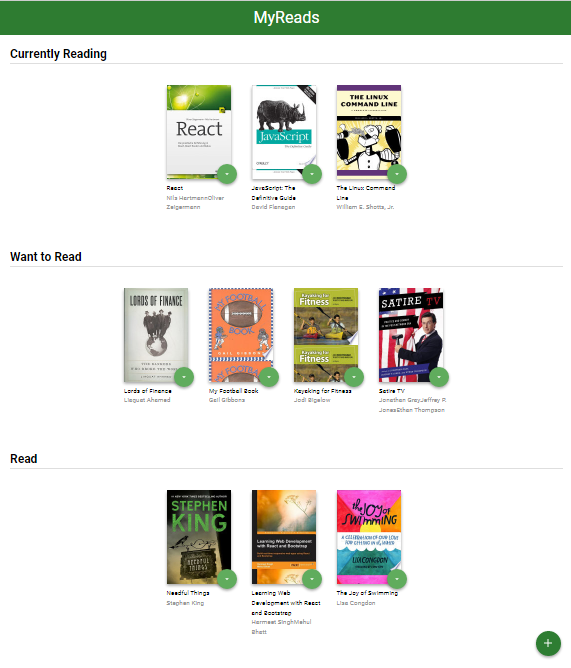
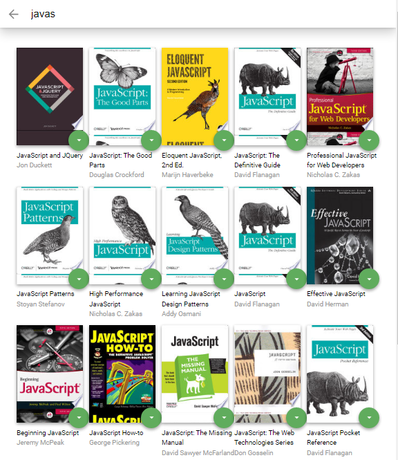

# MyReads Project

MyReads is a book-tracking application built as a graduation project from Udacity React development cross skilling Program.

## Project Features

- The main page shows three shelves for books. Each book is shown on the correct shelf, along with its title and all of its authors.
- The main page shows a control that allows users to move books between shelves.
- When the browser is refreshed, the same information is displayed on the page.
- The search page has a search input field, as the user types into the search field, books that match the query are displayed on the page.
- Search results on the search page allow the user to select “Currently Reading”, “Want to Read”, or “Read” to place the book in a certain shelf.

## Project structure

```
📦src
 ┣ 📂components
 ┃ ┣ 📜Book.js
 ┃ ┣ 📜MyReads.js
 ┃ ┗ 📜SearchPage.js
 ┣ 📂icons
 ┃ ┣ 📜add.svg
 ┃ ┣ 📜arrow-back.svg
 ┃ ┗ 📜arrow-drop-down.svg
 ┣ 📜App.css
 ┣ 📜App.js
 ┣ 📜BooksAPI.js
 ┣ 📜index.css
 ┗ 📜index.js
```

## Built-With

- [React](https://reactjs.org/) - UI Library
- [Create React App](https://github.com/facebookincubator/create-react-app) - React scaffolding package
- [React Router](https://github.com/ReactTraining/react-router) - Declarative routing for React
- [JavaScript ES6](https://developer.mozilla.org/en-US/docs/Web/JavaScript) - Programming Language
- [HTML5](https://developer.mozilla.org/en-US/docs/Web/Guide/HTML/HTML5) - Markup Language
- [CSS3](https://developer.mozilla.org/en-US/docs/Web/CSS/CSS3) - Styling
- [Google Chrome](https://www.google.com/chrome/) - Browser and Debugging Tool

## Installation

First begin by installing dependencies

```sh
npm install
```

Then run the application

```sh
npm start
```

## Snapshots




## Developer

**[Mohamed Elashmawy](https://github.com/m-ashmawy)**
